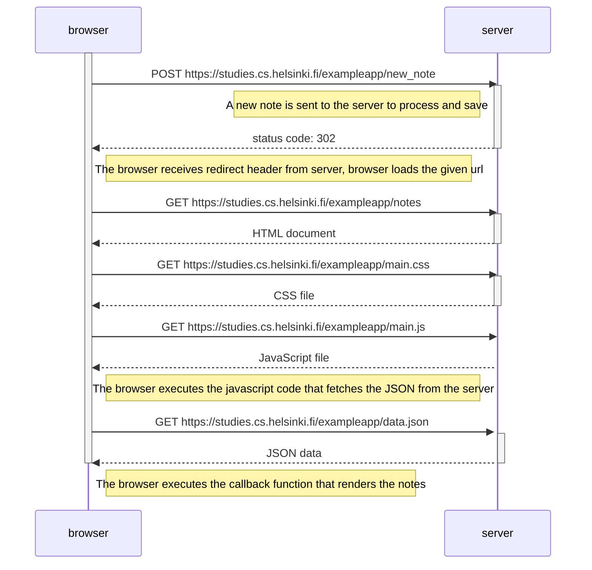

```mermaid
sequenceDiagram
    participant browser
    participant server

    activate browser

    browser->>server: POST https://studies.cs.helsinki.fi/exampleapp/new_note
    activate server
    Note left of server: A new note is sent to the server to process and save
    server-->>browser: status code: 302
    deactivate server

    Note right of browser: The browser receives redirect header from server, browser loads the given url

    browser->>server: GET https://studies.cs.helsinki.fi/exampleapp/notes
    activate server
    server-->>browser: HTML document
    deactivate server
    
    browser->>server: GET https://studies.cs.helsinki.fi/exampleapp/main.css
    activate server
    server-->>browser: CSS file
    deactivate server

    browser->>server: GET https://studies.cs.helsinki.fi/exampleapp/main.js
    activate server
    server-->>browser: JavaScript file
    Note right of browser: The browser executes the javascript code that fetches the JSON from the server

    browser->>server: GET https://studies.cs.helsinki.fi/exampleapp/data.json
    activate server
    
    server-->>browser: JSON data
    deactivate server

    deactivate browser

    Note right of browser: The browser executes the callback function that renders the notes
```