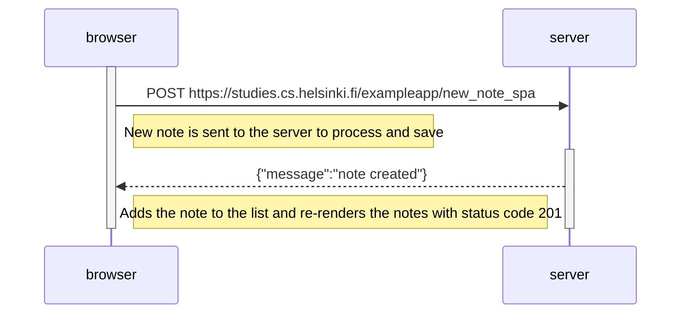

```mermaid
sequenceDiagram
    participant browser
    participant server
    activate browser

    browser->>server: POST https://studies.cs.helsinki.fi/exampleapp/new_note_spa

    Note right of browser: New note is sent to the server to process and save

    activate server
    server-->>browser: {"message":"note created"}

    Note right of browser: Adds the note to the list and re-renders the notes with status code 201

    deactivate server

    deactivate browser
```